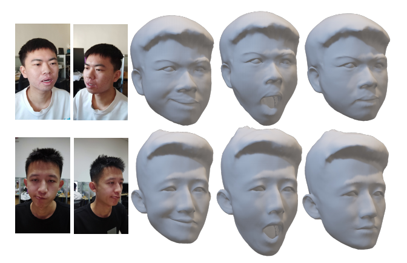

I'm Libo Zhang(张立博), a third year undergraduate student at [Tsinghua University](https://www.tsinghua.edu.cn/), major in Mathematics and Physics & Energy and Power Engineering. My research interest lies at the intersection of 3D vision and computer graphics, including neural rendering, visual geometric computing, and face modeling. 

I am very fortunate to be advised by [Prof. Feng Xu](http://xufeng.site/) of 3D Vision and Graphics Lab from [School of Software](https://cs.pku.edu.cn/), Tsinghua University. 

Education Experience
------
<!--  -->

<!--  -->

  <b>Tsinghua University, Beijing, China</b>  
  September 2021 - present   
  Undergraduate at <a href="https://www.wyc.tsinghua.edu.cn/">Weiyang College</a> 

  

Publications
------
### Preprints

  

  

    
      <b>High-Quality Mesh Blendshape Generation from Face Videos via Neural Inverse Rendering</b>
       
     
    
      Xin Ming&ast;, 
      Jiawei Li&ast;,
      Jingwang Lin,
      <b>Libo Zhang</b>,
      Feng Xu
       
     
    
      Preprint, 2023.11
       
     
    
      <a href="https://arxiv.org/abs/2401.08398">[paper]</a>
    
  

Reserach Experience
------

<!--  -->

  <b>Tsinghua University, Beijing, China</b>  
  July 2023 - May 2024   
  Research Intern at 3D Vision and Graphics Lab, School of Software 
  Advised by <a href="http://xufeng.site/">Prof. Feng Xu</a> 

  

Honors & Awards
------
- Comprehensive Excellence First Prize Scholarship, 2022
- Science and Technology Innovation Outstanding Scholarship, 2022
- Artificial Intelligence Challenge 3rd Prize, 2022
- Special Prize in Tsinghua Software Design Competition, 2023
- Science and Technology Innovation Outstanding Scholarship, 2023
